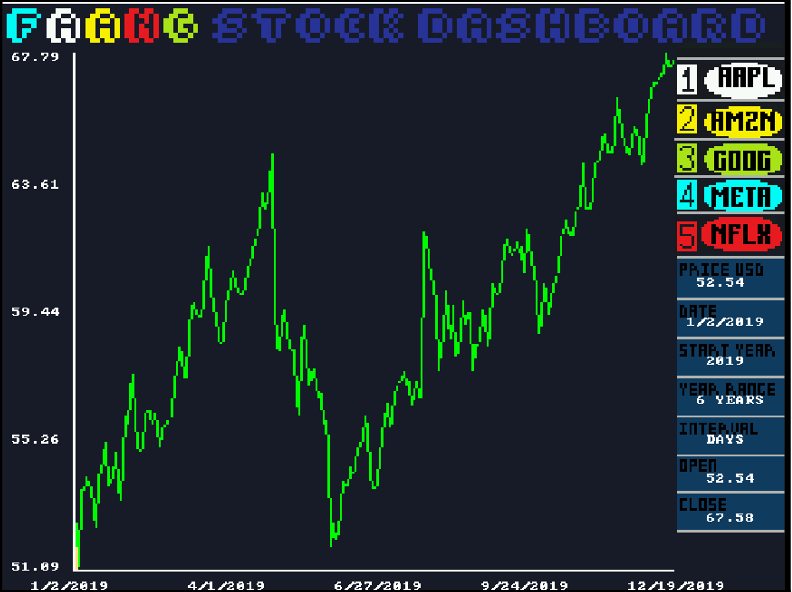
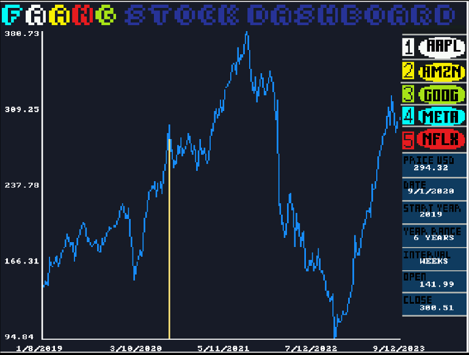
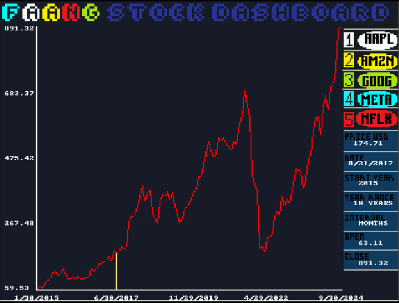
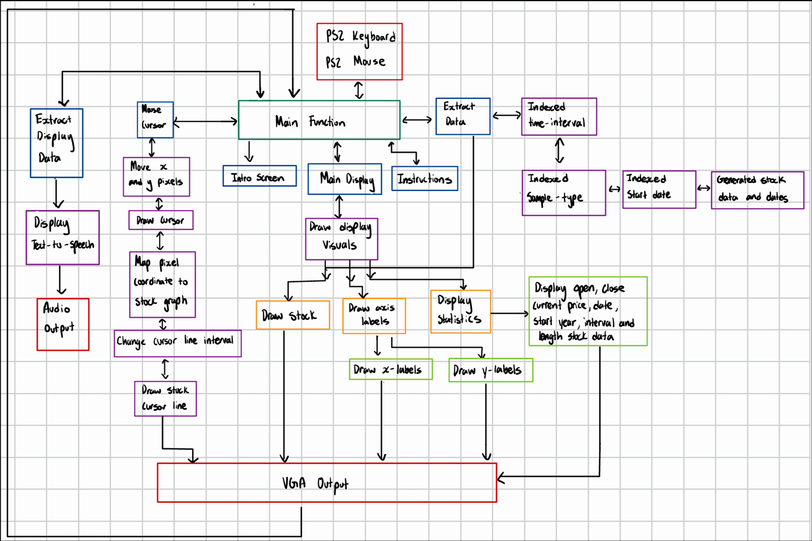

# 📈 FPGA Stock Market Analyzer

  
  
  
  
  
  
  
 

An **FPGA-based stock market dashboard** built on the **DE1-SoC board** to visualize and analyze 10 years of FAANG stock data.  
The system integrates **real-time rendering, user interaction via PS2 keyboard/mouse, dynamic scaling, and text-to-speech output**, providing a fully interactive financial analytics platform on custom hardware.  

---

## 🎯 Overview  
- **Timeline:** Jan 2025 – Apr 2025  
- **Tech Stack:** **DE1-SoC**, **FPGA**, **C**, **Assembly**, **VGA**, **PS2 I/O**, **Git** 
- **Impact:** Delivered a responsive stock analysis system with seamless rendering and advanced user interactivity.  

---

## 🧠 Technical Highlights  

- **Stock Data Integration:**  
  - Imported **10 years (2014–2024) of FAANG stock data**.  
  - Converted stock data into optimized **C arrays** for efficient FPGA usage.  

- **Dynamic Scaling Algorithms:**  
  - Implemented **real-time scaling & indexing** for smooth VGA graph rendering.  
  - Supported sampling intervals: **daily, weekly, monthly**.  

- **Interactive User Control:**  
  - **PS2 Keyboard & Mouse support** for:  
    - Stock switching (keys 1–5)  
    - Timeframe zoom (+/- for year ranges)  
    - Cursor traversal (<, >, mouse drag)  
  - Cursor-tracked statistics (price, date, open/close values).  

- **Enhanced Analytics & Display:**  
  - **Statistics sidebar** continuously updated with live calculations.  
  - **Text-to-speech output** for auditory stock updates.  

---

## 📊 Features Showcase  

### Main Dashboard View  
- Smooth stock display rendering on **VGA**.  
- Sidebar with **real-time statistics**.  
- User-controlled zooming & indexing.  

### User Interaction Flow  
1. **Intro Screen** → Press spacebar to start.  
2. **Instructions Screen** → Key/mouse controls (toggle with `H`).  
3. **Main Display** → Press 1–5 to view FAANG stocks.  
4. **Indexing** → Arrow keys adjust timeframe & sampling.  
5. **Cursor Tracking** → Locate exact stock values with keyboard/mouse.  

---

## 📽️ Demo  

🎥 **Video Walkthrough:** [Google Drive Link](https://drive.google.com/file/d/17qfD2idL0ijc8XOCcW2xP4rC3k5U3Mgw/view?usp=sharing)  

📸 **Statistical Features**

  

---

## 🧩 System Design  

### Block Diagram  
  

### Example Screens  
- Intro Screen  
- Instructions Screen  
- Stock Graph with Statistics Sidebar  

---
